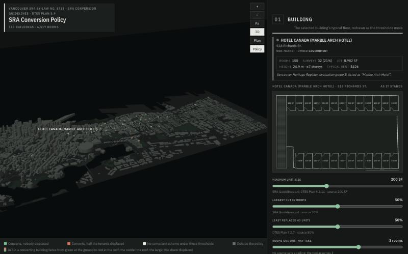
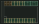

# SRO Conversion & Displacement in the DTES

**Live:** https://bridgettekelly07.github.io/sro_floorplate_optimizer/

## Purpose

<!-- Yours to write, 150 words or fewer: what the tool helps someone understand or do, and for whom.
     The paragraph below is a draft to replace. -->

Vancouver lets an SRO owner merge SRA-designated rooms into self-contained units if every unit reaches
200 SF, no more than half the rooms are lost, and at least half come back as units. Every merge removes a
room and the tenant in it. This tool shows what those thresholds cost in people: for one building, the
scheme that passes while displacing the fewest tenants, drawn on its typical floor; for the whole
Downtown Eastside stock, how many tenants each version of the policy displaces. The thresholds are
sliders, so the policy itself can be questioned. It is for anyone reading the SRA Guidelines, the DTES
Plan or the SRA By-law and asking who they reach.

## How to use it

Open the [live page](https://bridgettekelly07.github.io/sro_floorplate_optimizer/). The map is the
Downtown Eastside in 3D, every SRO coloured by what the policy does to it: green where nobody is
displaced, red where half the tenants are, white where no scheme can pass.

1. **Click a building.** Its record and typical floor appear in section 01, the rooms drawn as they
   stand with the square footage of each.
2. **Move a slider.** The plan redraws at the scheme that passes the new thresholds while losing the
   fewest rooms, with the three tests worked beneath it. Let go and the map recolours.
3. **Read section 02.** The same thresholds applied to every building: how many convert, how many
   tenants lose their room, and what is owed under s.4.8(i).

Drag to pan, shift-drag to orbit, scroll to zoom. **Plan** looks straight down; **Policy** toggles the
colouring back to tenure.

### Run it from source

Node 20.19 or newer.

```
npm install
npm run dev        # the dev server at http://localhost:5173
npm run build      # the production bundle, into frontend/dist: static files, host them anywhere
npm test           # 53 tests against the app's own modules: the hand-worked cases, the search, the policy
```

Everything runs in the browser. The data in `frontend/public/data` is City open data and Appendix B of
the 2024 SRO Tenant Survey.

## Source

The SRA Conversion Guidelines (p.4, p.5–6), the Downtown Eastside Plan (Policies 9.2.7, 9.2.11) and
the Single Room Accommodation By-law No. 8733 (s.1.2, s.4.3A, s.4.8). Versions, authority and the
annotated passages are in [`citation.md`](documentation/citation.md) and
[`source_extract.md`](documentation/source_extract.md), including a note on the December 2025
amendments; every threshold sits with its citation in [`policy.js`](frontend/src/lib/policy.js).

## One example

Hotel Canada, 518 Richards St.: 150 rooms, 25 to a floor, each read as 130 SF from the footprint.



At the City's 200 SF every unit must take two rooms: the least-loss scheme keeps 18 rooms as SRA, makes
84 units and loses 48, so 48 tenants are displaced, 32% of the building. At 150 SF most rooms convert in
place and the loss falls to 18.



## Limits

- The typical floor is a type, not a survey: the room count is Appendix B's, the outline is the City's,
  and the corridor, bays and stair between them are assumptions the plan states.
- Every room is taken as occupied, so rooms lost are tenants displaced, and the survey's average tenancy
  and rent price the compensation. Structure, the permit process and viability are not modelled.
- The replacement test counts every unit made, where Policy 9.2.7 counts social housing units, so the
  share reported is an upper bound.

## Further reading

[How the tool works](documentation/how_it_works.md) · [The hand-worked example](documentation/hand_worked_example.md) · [Every threshold in the sources](documentation/thresholds.md) · [Testing](documentation/TESTING.md)
